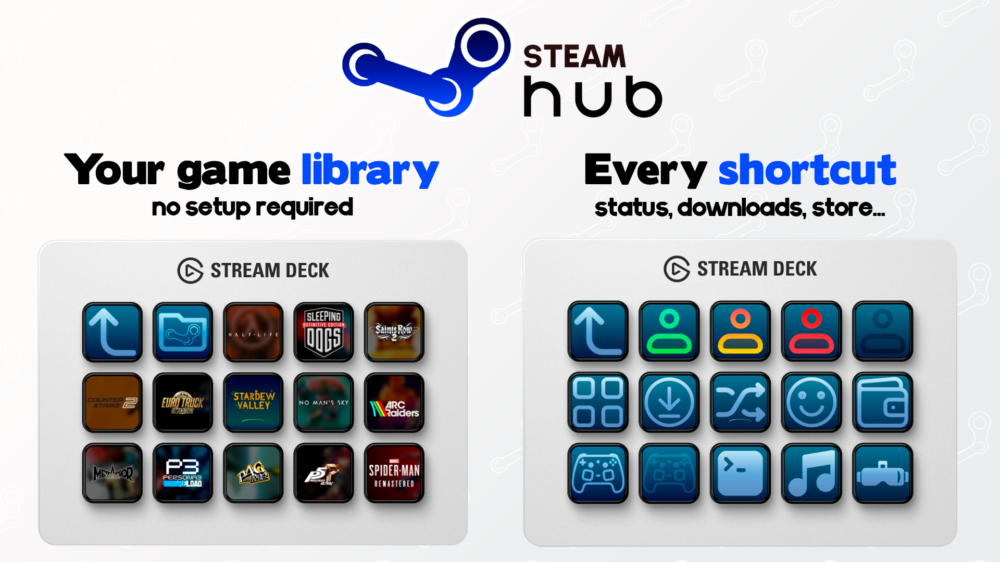

<h1 align="center">
   
  
</h1>

<h3 align="center">Turn your Stream Deck into a Steam hub.</h3>

  <a href="#key-features">Key Features</a> •
  <a href="#actions">Actions</a> •
  <a href="#setup">Setup</a> •
  <a href="#requirements">Requirements</a> •
  <a href="#download">Download</a> •
  <a href="#support">Support</a> •
  <a href="#contributing">Contributing</a> •
  <a href="#license">License</a>

<h1 align="center">
  
</h1>

**Steam Hub** turns your Stream Deck into a hub for your Steam library. Every key wears the game's own store art, so a full profile looks like a shelf of your games instead of a wall of generic icons. Fill a profile automatically, launch something at random, keep an eye on whatever's currently running, time your sessions, and jump straight into Big Picture, your friends list, or any other corner of Steam, all without touching your keyboard.

---

## Key Features

- Every key shows the game's own store art instead of a generic icon, so a profile ends up looking like a shelf of your library.
- Give each key a number with "Show installed games" and the plugin matches it to a game from your library on its own, no picking which game goes where by hand.
- A key can glow green while its game is running, amber while it's updating, so you can tell what's going on without leaving your desk.
- One key launches a random game and skips whatever it just picked, so it doesn't feel stuck on repeat.
- Now Playing and Play Timer don't need a game configured, they just follow whatever Steam currently has open.
- Shortcuts to Big Picture, your library, downloads, friends, and the rest of the Steam client, one key each.

---

## Actions

### Launch Game

Launches any installed Steam game from a key. Pick one from a dropdown of your library, recently played games are grouped at the top, or type a Steam App ID directly to target a game that isn't installed on this machine yet.

The key shows that game's own store art, capsule, header, hero art, or logo, your choice per key. Turn on **Show title** to draw the name over it too.

Turn on **Show status** and the key frames itself green while the game is running, amber while it's updating, so you can tell what's going on from across the room.

### Show Installed Games

Turns a whole profile into a gallery of your library. Give each key a **position**, `1`, `2`, `3`, and so on, in the property inspector, and the plugin fills it in with the matching game automatically, no picking a game for each key by hand.

Sort order (name, most recently played, or size), art style, and title all live in one shared settings panel: set them once on any key of the profile and every other key follows.

A key left with no position doubles as the way in: press it and it jumps straight to the games profile, handy as the one "open my library" key on a device's main profile.

> Only the original Stream Deck and the MK2 ship with a ready-made profile today. See [Requirements](#requirements) and [Contributing](#contributing) if you own another Elgato device.

### Library Dial

For devices with encoders. Turn the dial to scroll your whole library on the touch display, press to launch whatever it is showing, tap to open that game's Steam page. The display carries the game's store art, its name, and its position in the library, so you always know where you are.

Where **Show Installed Games** needs a key for every game you want within reach, a single dial reaches all of them, which is the only practical way to browse a large library on a device that cannot show it a key at a time. Each dial keeps its own place, so several dials can sit at different points in the library, and they remember where they were across restarts.

Sort order, art style, framing, and what a tap opens are all set per dial in the property inspector.

### Random Game

Launches a random installed game on every press, and keeps showing that pick's art afterward so the key stays useful between presses instead of going blank.

Never repeats the same game twice in a row while more than one is installed. Turn off **Remember last pick** if you'd rather the key reset between presses instead of showing the last game launched.

### Steam Shortcut

Jumps to a specific part of the Steam client from a single key: Big Picture, your Library, Downloads, Workshop, Friends, Screenshots, the Store, Settings, switching accounts, quitting Steam, and more, including a shortcut back into this plugin's own games profile.

### Steam Status

Switches your Steam presence, online, away, invisible, or offline, with a single press. Steam keeps your current status server-side, so the key can set it, it just can't show which one is currently active.

### Now Playing

There's no game to pick here, the key just follows Steam: it always shows whichever installed game is currently running or updating. Pressing it opens that game's Community Hub, a quick way into its screenshots, guides, and discussions while it's on screen.

### Play Timer

A stopwatch key with no game to configure either. It counts up for as long as a game is running, resets once it closes, and opens that game's Community Hub when pressed.

### Game Page

Opens one specific game's store page, Community Hub, or uninstall dialog, using the same game picker as Launch Game. Since the key always labels itself by page rather than by game name, you can line up several of these side by side for the same game, store page, hub, uninstall, and still tell them apart at a glance.

---

## Requirements

- **Stream Deck** software 7.1 or later.
- **Windows** 10 or 11, or **macOS** 12 or later.
- **Steam**, installed and signed in, with at least one game in your library.

> The live status border, Now Playing, and Play Timer currently rely on a Windows-only source for Steam's running/updating state. On macOS, games still launch and show their art normally, just without the live status.

> Right now, only the original Stream Deck and the MK2 have a ready-made "Show installed games" profile bundled with the plugin. Other devices (Mini, XL, Neo, +, ...) can still use every action, they just need their keys set up by hand, or a profile contributed by someone who owns that device. See [CONTRIBUTING.md](CONTRIBUTING.md).

---

## Setup

1. **Install the plugin**, see [Download](#download) below.
2. **Drag an action** onto any key:
   - **Launch Game**, pick a game from the dropdown.
   - **Show Installed Games**, set a position number to fill that key automatically.
   - **Random Game**, launches something different on every press.
   - **Steam Shortcut** or **Steam Status**, pick a destination or state.
3. **Press the key.**

To fill a whole profile with your library, drag **Show Installed Games** onto every key you want to use and number them `1`, `2`, `3`, and so on. The rest of the profile fills itself in.

---

## Download

Get the latest release from the [Stream Deck Marketplace](https://marketplace.elgato.com/product/steam-hub-c85128ab-908f-4a9d-ad79-c909b243c729) or the [GitHub Releases page](https://github.com/unaigonzalezz/steam-hub/releases).

---

## Support

If you would like to support development:

If you can't donate, leaving a ⭐ on [the repo](https://github.com/unaigonzalezz/steam-hub) goes a long way too.

---

## Contributing

Pull requests are welcome on [GitHub](https://github.com/unaigonzalezz/steam-hub). The guide that needs the most help right now is bringing "Show installed games" to Elgato devices other than the original Stream Deck/MK2, see [CONTRIBUTING.md](CONTRIBUTING.md) for the full walkthrough. For anything else, open an issue first to discuss what you would like to change.

---

## License

[MIT](https://choosealicense.com/licenses/mit/)

---
