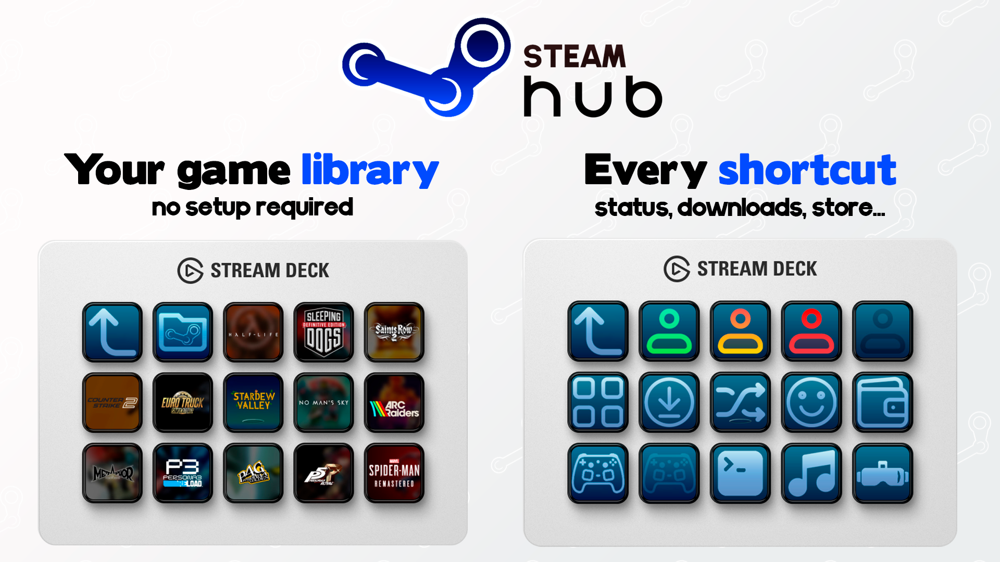

<h1 align="center">
   
  
</h1>

<h3 align="center">Turn your Stream Deck into a Steam hub.</h3>

  <a href="#key-features">Key Features</a> •
  <a href="#actions">Actions</a> •
  <a href="#setup">Setup</a> •
  <a href="#requirements">Requirements</a> •
  <a href="#download">Download</a> •
  <a href="#support">Support</a> •
  <a href="#contributing">Contributing</a> •
  <a href="#license">License</a>

<h1 align="center">
  
</h1>

**Steam Hub** turns your Stream Deck into a hub for your Steam library. Every key wears the game's own store art, so a full profile looks like a shelf of your games instead of a wall of generic icons. Fill a profile automatically, launch something at random, keep an eye on whatever's currently running, time your sessions, and jump straight into Big Picture, your friends list, or any other corner of Steam, all without touching your keyboard.

---

## Key Features

- Every key shows the game's own store art instead of a generic icon, so a profile ends up looking like a shelf of your library.
- Give each key a number with "Show installed games" and the plugin matches it to a game from your library on its own, no picking which game goes where by hand.
- Point a page of keys, a dial, or the random key at one of your Steam collections, so each profile can hold its own shelf: favourites on one, co-op games on another.
- A key can glow green while its game is running, amber while it's updating, so you can tell what's going on without leaving your desk.
- One key launches a random game and skips whatever it just picked, so it doesn't feel stuck on repeat.
- Now Playing and Play Timer don't need a game configured, they just follow whatever Steam currently has open.
- Shortcuts to Big Picture, your library, downloads, friends, and the rest of the Steam client, one key each.

---

## Actions

### Launch Game

Launches any installed Steam game from a key. Pick one from a dropdown of your library, recently played games are grouped at the top, or type a Steam App ID directly to target a game that isn't installed on this machine yet.

The key shows that game's own store art, capsule, header, hero art, or logo, your choice per key. Turn on **Show title** to draw the name over it too.

Turn on **Show status** and the key frames itself green while the game is running, amber while it's updating, so you can tell what's going on from across the room.

### Show Installed Games

Turns a whole profile into a gallery of your library. Set a key's **Key** option to **Game, automatic** and it takes the next free slot from where it sits on the device, left to right, top to bottom, and the plugin fills it in with the matching game, no picking a game, or even a number, for each key by hand. **Game, fixed slot** lets you type the slot yourself for a key that should stay put; automatic keys fill the slots left free around it.

Sort order (name, most recently played, or size), art style, and title all live in one shared settings panel: set them once on any key of the profile and every other key follows.

Each key can write something along its top and bottom edges: the game's name, the hours you've played it (in total or over the last two weeks), how long ago you last played it, how long ago it last updated, how many of its achievements you've unlocked, or its size on disk. Achievements only show for games Steam has loaded stats for on this PC, typically ones you've launched here. Pick what goes where with **Top** and **Bottom**. These only show while the game is closed; while it runs or updates, the top makes way for the play time and the bottom keeps only the name.

Each key can also be pointed at one of your **Steam collections** instead of the whole library, so its numbers count through that collection alone. Set it on one key and press **Use on every key of this page** to copy it across, then repeat on another profile with a different collection: one for favourites, one for co-op, one for whatever you're playing through right now. By default only installed games appear; turn on **Not installed** and the rest of the collection follows them, in black and white, most recently played first, and pressing one opens Steam's install dialog. Dynamic collections aren't offered, since Steam stores those as a filter rather than a list of games.

Set to **Open Steam Hub profile**, the key is the way in instead: press it and it jumps straight to the games profile, handy as the one "open my library" key on a device's main profile. A newly dragged key starts like this, and so do keys set up before the Key option existed with no number, so existing entry keys keep working.

> The original Stream Deck, the MK2, the Stream Deck XL, the Stream Deck +, and the Stream Deck + XL ship with a ready-made profile today. See [Requirements](#requirements) and [Contributing](#contributing) if you own another Elgato device.

### Library Page

Pages through your library with a single page of keys, however long it is. Put a **Next** and a **Previous** key next to your **Show Installed Games** keys: each press shifts every one of them on that device by a whole page, so slot 1 on page 3 of a 13-key page shows game 27. The page size is simply the highest slot on the device, nothing to configure. **Next** wraps round from the last page to the first; **Previous** on the first page takes you back to the profile you came from, the same way out as the Back shortcut, and shows a back arrow to say so (turn that off and it wraps to the last page instead).

The key shows where you are, e.g. `3 / 20`. Hold **Next** to jump straight to the last page, or **Previous** to jump straight back to the first. Changing a collection or the sort order goes back to the first page, and every start of Stream Deck opens on it too.

### Library Dial

For devices with encoders. Turn the dial to scroll your whole library on the touch display, press to launch whatever it is showing, tap to open that game's Steam page. The display carries the game's store art, its name, and its position in the library, so you always know where you are.

Where **Show Installed Games** needs a key for every game you want within reach, a single dial reaches all of them, which is the only practical way to browse a large library on a device that cannot show it a key at a time. Each dial keeps its own place, so several dials can sit at different points in the library, and they remember where they were across restarts.

When the game on show is the one currently running, the art is framed green, amber while it's updating, and the position line counts up alongside it, the same signals the keys use.

Sort order, collection, art style, framing, what a tap opens, and both of those indicators are set per dial in the property inspector.

### Random Game

Launches a random installed game on every press, and keeps showing that pick's art afterward so the key stays useful between presses instead of going blank.

Pick a **collection** to draw only from that one, a "backlog" collection, say. Never repeats the same game twice in a row while more than one is available. Turn off **Remember last pick** if you'd rather the key reset between presses instead of showing the last game launched.

### Steam Shortcut

Jumps to a specific part of the Steam client from a single key: Big Picture, your Library, Downloads, Workshop, Friends, Screenshots, the Store, Settings, switching accounts, quitting Steam, and more, including a shortcut back into this plugin's own games profile.

### Steam Status

Switches your Steam presence, online, away, invisible, or offline, with a single press. Steam keeps your current status server-side, so the key can set it, it just can't show which one is currently active.

### Now Playing

There's no game to pick here, the key just follows Steam: it always shows whichever installed game is currently running or updating. Pressing it opens that game's Community Hub, a quick way into its screenshots, guides, and discussions while it's on screen.

### Play Timer

A stopwatch key with no game to configure either. It counts up for as long as a game is running, resets once it closes, and opens that game's Community Hub when pressed.

### Last Achievement

No game to pick here either, the key follows whatever Steam currently has open and shows the icon of the most recently unlocked achievement in that game. Pressing it opens that game's Community Hub, same as Now Playing and Play Timer.

Read entirely from Steam's own local stat cache, so it needs no Steam Web API key. That also means it only knows about a game once Steam has fetched its stats locally, launching it once is enough, and it stays idle until something has actually unlocked.

Unlocking one while **Show Installed Games** is on screen also takes over that game's own key for 3 seconds, showing the achievement instead of the usual art before switching back on its own, so you catch it even without a Last Achievement key configured.

### Game Page

Opens one specific game's store page, Community Hub, or uninstall dialog, using the same game picker as Launch Game. Since the key always labels itself by page rather than by game name, you can line up several of these side by side for the same game, store page, hub, uninstall, and still tell them apart at a glance.

---

## Requirements

- **Stream Deck** software 7.1 or later.
- **Windows** 10 or 11, or **macOS** 12 or later.
- **Steam**, installed and signed in, with at least one game in your library.

> The live status border, Now Playing, and Play Timer currently rely on a Windows-only source for Steam's running/updating state. On macOS, games still launch and show their art normally, just without the live status.

> Right now, the original Stream Deck, the MK2, the Stream Deck XL, the Stream Deck +, and the Stream Deck + XL have a ready-made "Show installed games" profile bundled with the plugin. Other devices (Mini, Neo, Studio, ...) can still use every action, they just need their keys set up by hand, or a profile contributed by someone who owns that device. See [CONTRIBUTING.md](CONTRIBUTING.md).

---

## Setup

1. **Install the plugin**, see [Download](#download) below.
2. **Drag an action** onto any key:
   - **Launch Game**, pick a game from the dropdown.
   - **Show Installed Games**, set **Key** to **Game, automatic** to fill that key automatically.
   - **Random Game**, launches something different on every press.
   - **Steam Shortcut** or **Steam Status**, pick a destination or state.
3. **Press the key.**

To fill a whole profile with your library, drag **Show Installed Games** onto every key you want to use, set one of them to **Game, automatic**, and press **Use on every key of this page**. The rest of the profile fills itself in.

### How a games profile works

A games profile is **one page** of keys, however big your library is:

- **Game keys** (**Show Installed Games**, `N` of them) show the first `N` games of the list. Automatic keys number themselves in grid order; fixed keys keep the slot typed into them.
- A **Library Page** key set to **Next** moves every game key on the device forward by `N`, and wraps from the last page back to the first. One set to **Previous** moves back, and on the first page it becomes the way out, a back arrow that returns to the profile you came from.
- **A key set to Open Steam Hub profile** is the way in. Put it on your main profile; pressing it opens the bundled Steam Hub profile.

The page is kept per device, starts on page 1 every time Stream Deck starts, and goes back to page 1 when the list changes underneath it (another collection, sort order, or download/not-installed setting).

**One profile per collection.** Every game key can be pointed at a Steam collection. To have a profile for favourites and another for co-op games:

1. Duplicate the Steam Hub profile in the Stream Deck app (or build one with automatic game keys and two Library Page keys).
2. On any game key, pick the **Collection** and press **Use on every key of this page**.
3. To get there, use Stream Deck's own **Switch Profile** action, pointing at the new profile. A key set to Open Steam Hub profile only ever opens the bundled one, since a plugin can only switch to profiles it ships itself.

The **Previous** key's way out works from any of these profiles: it always returns to wherever you came from.

---

## Download

Get the latest release from the [Stream Deck Marketplace](https://marketplace.elgato.com/product/steam-hub-c85128ab-908f-4a9d-ad79-c909b243c729) or the [GitHub Releases page](https://github.com/unaigonzalezz/steam-hub/releases).

---

## Support

If you would like to support development:

If you can't donate, leaving a ⭐ on [the repo](https://github.com/unaigonzalezz/steam-hub) goes a long way too.

---

## Contributing

Pull requests are welcome on [GitHub](https://github.com/unaigonzalezz/steam-hub). The guide that needs the most help right now is bringing "Show installed games" to Elgato devices other than the original Stream Deck/MK2, see [CONTRIBUTING.md](CONTRIBUTING.md) for the full walkthrough. For anything else, open an issue first to discuss what you would like to change.

---

## Acknowledgements

Text drawn on the keys (page numbers, play time, download progress and game names) uses the **Gila** typeface by **Khurasan**, free for personal and commercial use.

Key icons are built from these icon sets:

- [IconaMoon](https://github.com/dariushhpg1/IconaMoon) by Dariush Habibpour, licensed under [CC BY 4.0](https://creativecommons.org/licenses/by/4.0/).
- [Sargam Icons](https://github.com/planetabhi/sargam-icons) by Abhimanyu Rana, licensed under [MIT](https://opensource.org/licenses/MIT).

---

## License

[MIT](https://choosealicense.com/licenses/mit/)

The Gila font files in `com.unai-gonzalez.steam-hub.sdPlugin/fonts/` belong to their author and are not covered by the MIT license.

---
